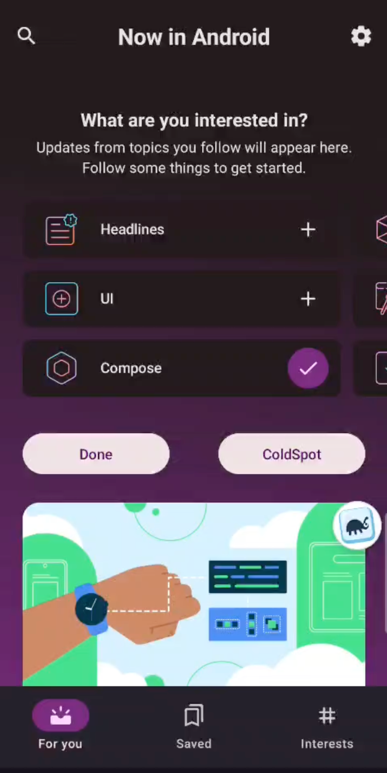
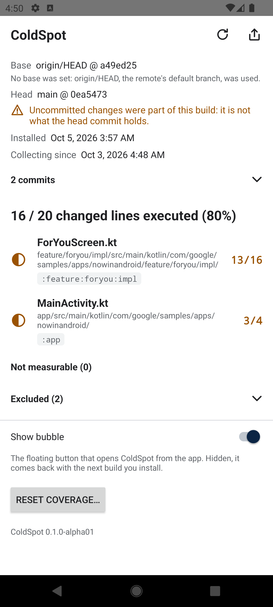
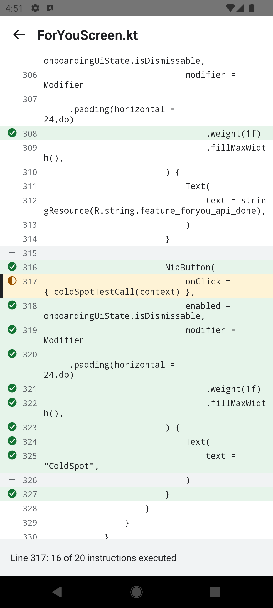

# ColdSpot

See, inside your running debug app, which lines you changed and which of them have executed.

[](https://central.sonatype.com/artifact/io.github.tensky.coldspot/plugin)
[](https://developer.android.com/about/versions/lollipop)
[](https://developer.android.com/build/releases/gradle-plugin)
[](LICENSE)

<p align="center">
  
  
  
</p>

ColdSpot is debug-only tooling for Android, for developers and QA on manual builds from Android
Studio.

- Diffs your working tree, uncommitted edits included, against a base branch, once per build.
- Instruments only the classes that hold changed lines, with JaCoCo, in a `coverage` build type it
  makes from `debug`.
- Colours every changed line inside the running app: green when all of it executed, amber when some
  of it did or it can't tell, red when none of it did.
- Keeps coverage across launches and rebuilds, and shares a text summary for a pull request or a
  ticket.
- Stays out of debug and release builds.

## Demo

https://github.com/user-attachments/assets/6bf8c6ca-58c6-4d33-8396-81ef5d4cbc04

## Requirements

- AGP 9.x and Gradle 9, on JDK 17 or newer
- An app with minSdk 21 or higher
- A git repository with its history, back to where the branch forked from its base

## Setup

ColdSpot is on [Maven Central](https://central.sonatype.com/artifact/io.github.tensky.coldspot/plugin).
`mavenCentral()` has to be among the repositories of `pluginManagement` and
`dependencyResolutionManagement` in `settings.gradle.kts`, and of `dependencyResolutionManagement`
in `build-logic/settings.gradle.kts`. Most Android projects list it in all three already.

**1. Give your convention plugins ColdSpot**, by its plugin marker:

```kotlin
// build-logic/convention/build.gradle.kts
dependencies {
    implementation("io.github.tensky.coldspot:io.github.tensky.coldspot.gradle.plugin:0.1.0-alpha01")
}
```

**2. Apply it** in the convention plugin for application modules, and in the one for Android library
modules:

```kotlin
apply(plugin = "io.github.tensky.coldspot")
```

A module without convention plugins applies it as any plugin:
`plugins { id("io.github.tensky.coldspot") version "0.1.0-alpha01" }`.

**3. Run the coverage build, not debug.** Pick the coverage variant under Build Variants in Android
Studio and run the app, or:

```
./gradlew :app:installCoverage        # :app:installDemoCoverage with a product flavor "demo"
```

**To see something, build a change:** on a feature branch, or with
`-Pcoldspot.base=<an older commit>`. On a main that was just pushed there is nothing to show.

## A working example

[tensky/nowinandroid-coldspot-demo](https://github.com/tensky/nowinandroid-coldspot-demo) is a fork of Google's Now in Android
with ColdSpot set up from Maven Central, to try ColdSpot without touching an app of your own and to
see the set-up in a real multi-module build:

```
git clone https://github.com/tensky/nowinandroid-coldspot-demo.git
cd nowinandroid-coldspot-demo
./gradlew :app:assembleDemoCoverage
./gradlew :app:installDemoCoverage
```

- [The set-up](https://github.com/android/nowinandroid/compare/main...tensky:nowinandroid:coldspot-base)
  is one commit on top of Now in Android.
- [The changed lines](https://github.com/tensky/nowinandroid/compare/coldspot-base...main) that
  ColdSpot shows there are what the fork's `main` adds to its `coldspot-base` branch.

## The coverage build

ColdSpot lives in a build type of its own, `coverage`, which the plugin adds to every module it is
applied to. **An app built as `debug` has no bubble, no ColdSpot screen, and collects nothing.**

- It is a build type, not a product flavor, so it pairs with each flavor as `debug` does: `demo`
  and `prod` give `demoCoverage` and `prodCoverage`.
- It is made from `debug`: debuggable, with debug's signing, dependencies and application ID. A
  coverage build and a debug build therefore replace each other on a device, unless
  `coldSpot { applicationIdSuffix = ".coverage" }` sets them apart.
- Debug and release builds are left alone: nothing of ColdSpot is in them.

Every rule is in [The coverage build type](docs/configuration.md#the-coverage-build-type).

## Using it

Tap the bubble ColdSpot adds to the app's screens. The overview shows what was built, the total
("16 / 20 changed lines executed (80%)") and the changed files, worst first. Tap a file for its
changed lines, each marked green, amber or red, and a line for the reason, such as "16 of 20
instructions executed".

**Share summary** sends the lines still to execute as text for a pull request, a ticket or a chat:
paths and line numbers, never source. **Reset coverage…** starts collecting afresh; otherwise
coverage builds up across launches and rebuilds.

More in [Using ColdSpot](docs/using.md).

## Configuration

```kotlin
coldSpot {
    baseRef = "origin/develop"           // default: origin/HEAD, origin/main, origin/master
    applicationIdSuffix = ".coverage"    // default: debug's application ID
    exclude("**/generated/**")           // on top of the default rules
    bubble = true                        // the default
    launcherIcon = false                 // the default
}
```

Every setting, the Gradle properties, the runtime API and the adb broadcasts are in
[Configuration](docs/configuration.md).

## CI

Not confirmed yet: ColdSpot has not been run on a real CI service. What a CI build needs, and
set-ups to try, are in [CI builds (not yet confirmed)](docs/ci.md).

## Limitations

- Plain Kotlin/JVM modules are not measured yet (planned for v0.2): their files show as "not
  measurable", never red.
- Lambdas from a library's inline function (`items { }`, Flow operators) show "Can't be measured":
  amber, never red.
- Kotlin and Java sources only: changed layouts, resources and build scripts are not shown.
- AGP 9 only.
- In a repository with several apps, a file only another app includes shows as "not measurable".

## Documentation

- [Using ColdSpot](docs/using.md): the screens, every marker, sharing, resetting
- [Configuration](docs/configuration.md): every setting, the exclude rules, the runtime API
- [Troubleshooting](docs/troubleshooting.md): every message ColdSpot shows, with its cause and fix
- Design records: [DECISIONS.md](DECISIONS.md) and [FINDINGS.md](FINDINGS.md)

## License

Copyright 2026 tensky. Licensed under the [Apache License, Version 2.0](LICENSE).

ColdSpot repackages JaCoCo (EPL-2.0), ASM (BSD-3-Clause) and JGit (Eclipse Distribution License 1.0),
with JavaEWAH and Apache Commons Codec (both Apache-2.0), under `id.tensky.coldspot.shaded`. Their
license texts and notices travel with the artifacts: see
[the plugin's](tooling/plugin/src/main/resources/META-INF/coldspot/THIRD-PARTY-NOTICES.txt) and
[the runtime's](jacoco-shaded/src/main/resources/META-INF/coldspot/THIRD-PARTY-NOTICES.txt).
